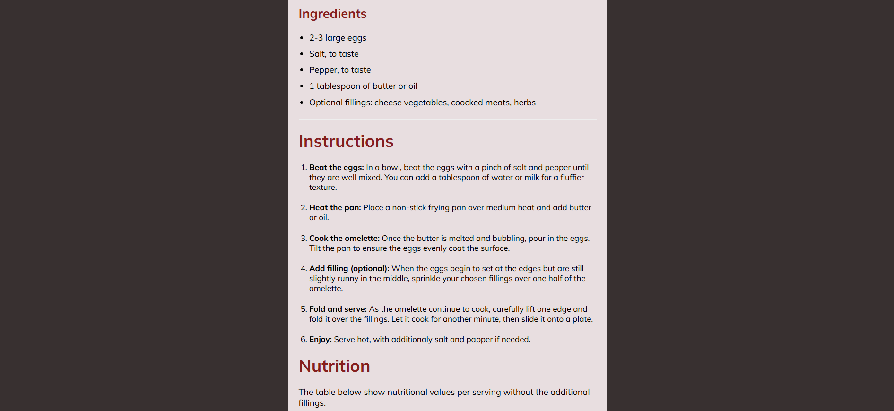

<h1>🍳 Simple Omelette Recipe – HTML & CSS</h1>

This project is a clean and responsive recipe webpage built with HTML and CSS. It presents a Simple Omelette Recipe with a structured layout including preparation time, ingredients, step-by-step instructions, and a styled nutrition table.

<h1>✨ Features</h1>

<ul>
  <li>Minimal and modern UI design</li>
  <li>Google Fonts integration (Mulish & Poppins)</li>
  <li>Structured sections for better readability</li>
  <li>Styled nutrition table with highlighted values</li>
  <li>Beginner-friendly HTML & CSS project</li>
</ul>

